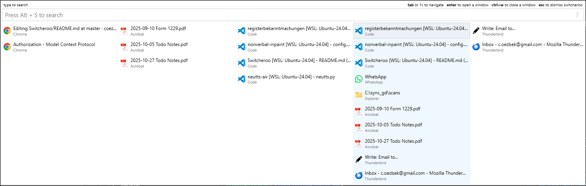

 Switcheroo  [](https://ci.appveyor.com/project/kvakulo/switcheroo) 
==========

Switcheroo is for anyone who spends more time using a keyboard than a mouse.
Instead of alt-tabbing through a (long) list of open windows, Switcheroo allows
you to quickly switch to any window by typing in just a few characters of its title.

## Screenshot




## Download

**[Download Switcheroo here](https://github.com/coezbek/Switcheroo/releases)**


## Usage

Action                         | Shortcut          | Remarks
------------------------------ | ----------------- | ----------
Activate Switcheroo            | `Alt + Space`     | This shortcut can be customized in _Options_
Activate Switcheroo            | `Alt + Tab`       | Only works if enabled under _Options_
_When Switcheroo is open_      |                   |
Switch to selected window      | `Enter`           |
Close selected window          | `Alt or Ctrl + W` |
Dismiss Switcheroo             | `Esc or Alt + Q`  |
Up and down in list            | `Up` / `Down`     | Also works with `Alt + J` / `Alt + K` and when holding `Alt`. Also works with mouse wheel.
Navigate columns               | `Left` / `Right`  | Also works when holding `Alt`. `Alt+Shift+Wheel` to scroll columns.
Cycle most common apps         | `Alt + ~`         |

## Column Mode

Switcheroo displays windows in five columns:

- The center column shows the 10 most recently used windows and all windows not shown in other columns.
- The three columns to the left show windows from the three most common applications.
- The rightmost column shows pinned windows (defined in _Options_).

## TODO
- [x] Ensure the 10 most recent windows remain in the center column, even if duplicated in other columns.
- [x] Implement a fixed, identical width for all columns.
- [x] Center the entire window so the middle column is perfectly centered on the screen.
- [ ] When less than 5 columns are necessary, the central column must still remain on the same exact spot.
- [x] Use mouse-wheel to scroll through the current active list.
- [x] During search results are shown in the center column, while the other columns stay visible.
- [x] Automatically remove common suffixes (e.g., " - Google Chrome") if they appear in more than half of all open windows of the same process.
- [x] Fix navigation with `Alt + Left`/`Right` arrow keys.
- [x] Resolve focus and selection issues when using the mouse to select an item.
- [x] After pressing Alt+W the focus must be moved to the next item in the list.
- [x] Make it user configurable if single or double click is needed to switch to a window.
- [ ] Make pinned windows configurable from the UI / Settings.
- [ ] Allow to highlight some of the windows based on regex rules.
- [ ] For left/app columns allow Alt+Shift+W to close all windows in that column.
- [ ] Add right click menu to windows for "Close", "Pin/Unpin", "Bring to front", "Open File Location", "Copy Window Title".
- [x] Add Right Shift key support in shift key checks - from fork georgeyu/Switcheroo


## History

Switcheroo was originally developed by [James Sulak](https://github.com/jsulak).

[Regin Larsen](https://github.com/kvakulo) took over the project in 2014 and is the current maintainer.

This fork is maintained by [Christopher Özbek](https://github.com/coezbek).

## Other projects

- [Alt-Tab Terminator]() - Commercial alt-tab replacement with window previews.
- https://github.com/hdlx/AltAppSwitcher - If you want Alt+Tab to be like MacOS's app switcher.


How to contribute
-----------------

Please report any bug you encounter by [submitting an issue](https://github.com/kvakulo/Switcheroo/issues/new).

If you have an idea how to improve Switcheroo, then don't be shy to submit it as well.

Pull requests are greatly appreciated. If you plan a larger feature, then please get in contact, so we can coordinate the efforts.

How to build
------------

```
nuget.exe restore Switcheroo.sln
msbuild.exe Switcheroo.sln /p:Configuration=Release
```


License
-------

Switcheroo is open source and is licensed under the [GNU GPL v. 3](http://www.gnu.org/licenses/gpl.html).

```
Copyright 2014, 2015 Regin Larsen
Copyright 2009, 2010 James Sulak
 
Switcheroo is free software: you can redistribute it and/or modify
it under the terms of the GNU General Public License as published by
the Free Software Foundation, either version 3 of the License, or
(at your option) any later version.

Switcheroo is distributed in the hope that it will be useful,
but WITHOUT ANY WARRANTY; without even the implied warranty of
MERCHANTABILITY or FITNESS FOR A PARTICULAR PURPOSE.  See the
GNU General Public License for more details.
 
You should have received a copy of the GNU General Public License
along with Switcheroo.  If not, see <http://www.gnu.org/licenses/>.
```


Credits
-------

[HellBrick](https://github.com/HellBrick), [ovesen](https://github.com/ovesen), [philippotto](https://github.com/philippotto), [tarikguney](https://github.com/tarikguney), [holymoo](https://github.com/holymoo), [elig0n](https://github.com/elig0n) and [trond-snekvik](https://github.com/trond-snekvik) have contributed to Switcheroo.

Switcheroo makes use of these great open source projects:

* [Managed Windows API](http://mwinapi.sourceforge.net), Copyright © 2006 Michael Schier, GNU Lesser General Public License (LGPL)
* [PortableSettingsProvider](https://github.com/crdx/PortableSettingsProvider), Copyright © crdx, The MIT License (MIT)
