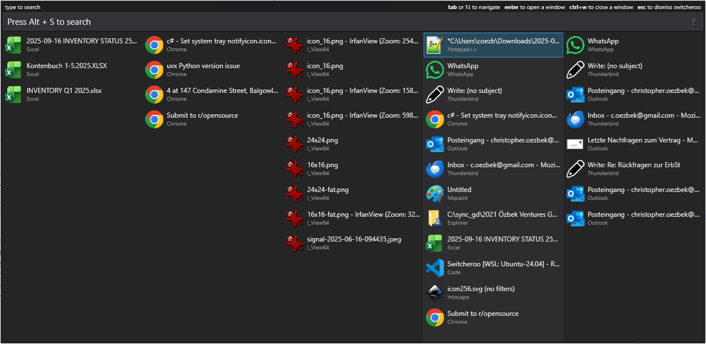

 Switcheroo++ [](https://github.com/coezbek/Switcheroo/actions/workflows/release.yml)
==========

Switcheroo++ is Alt-Tab replacement for Windows.

The idea of this project of to present windows in a column format: the most recent windows in the center column, the most common applications to the left, and pinned windows to the right.

Switcheroo++ is a fork of [Regin Larsen's Switcheroo](https://github.com/kvakulo/Switcheroo).

## Screenshot



## Download

**[Download Switcheroo here](https://github.com/coezbek/Switcheroo/releases)**

## Usage

Action                         | Shortcut          | Remarks
------------------------------ | ----------------- | ----------
Activate Switcheroo            | `Alt + Space`     | This shortcut can be customized in _Options_
Activate Switcheroo            | `Alt + Tab`       | Only works if enabled under _Options_
_When Switcheroo is open_      |                   |
Enter search mode              | `Alt + S`         |
Switch to selected window      | `Enter`           | Or release `Alt` if opened with `Alt + Tab` and `_altTabAutoSwitch` is enabled in _Options_. Note: independently from `_altTabAutoSwitch`, pressing and release `Alt` will select the currently highlighted window and switch to it.
Close selected window          | `Alt or Ctrl + W` |
Dismiss Switcheroo             | `Esc or Alt + Q`  |
Up and down in list            | `Up` / `Down`     | Also works with `Alt + J` / `Alt + K` and when holding `Alt`. Also works with mouse wheel.
Navigate columns               | `Left` / `Right`  | Also works when holding `Alt`. `Alt+Shift+Wheel` to scroll columns.
Cycle most common apps         | `Alt + ~`         |
Keep Switcheroo open           | `Ctrl`            | Hold while releasing `Alt` to keep Switcheroo open if in `_altTabAutoSwitch` mode.
Launch Explorer                | `Alt + E`         | Opens a new File Explorer window.
Launch current process         | `Alt + N`         | Launches a new instance of the currently selected window's process.
Anonymize window titles        | `Alt + P`         | Toggles anonymization of window titles for privacy during screen sharing or screenshots.

### Mouse Usage

- Double click a window to switch to it. (Configurable in _Options_ if single click is also possible.)
- Mouse wheel scrolls through the current active list.
- `Shift + Mouse Wheel` scrolls through columns.
- `Shift + Click` and `Ctrl + Click` select windows for multi-selection (for closing multiple windows at once).

## Column Mode

Switcheroo displays windows in five columns:

- The center column shows the 10 most recently used windows and all windows not shown in other columns.
- The three columns to the left show windows from the three most common applications.
- The rightmost column shows pinned windows (defined in _Options_).

## Todo List

- [ ] Support for Virtual Desktops
- [ ] Assign shortcut - https://github.com/elig0n/Switcheroo/issues/30
- [ ] Tagging windows - https://github.com/kvakulo/Switcheroo/issues/174
- [ ] Add option to disable stand-alone `ALT` keypress to switch to selected window. Currently this is enabled by default, but a bit surprising (see: https://github.com/kvakulo/Switcheroo/pull/128)
- [ ] Theme support.
- [ ] Allow to highlight some of the windows based on regex rules.
- [ ] Fix update checker
- [ ] Proper logging/crash reporting

## New features in Version 0.9.7

- [x] Alt+p to anonymize window titles for screenhots/demos/privacy
- [x] Slight corner radius and shadow for the main window
- [x] Keyboard support in options menu
- [x] When closing window which asks for feedback, activate it.
- [x] Fix: Pinning doesn't mess up current columns/filtering.

## New Features in Version 0.9.6

- [x] Support for disabling column-mode.
- [x] Support for limiting maximum number of results during search to improve performance on systems with many windows.
- [x] UWP app search speed improvements.
- [x] Preload window data on startup to improve first invocation speed.
- [x] Support processes at UNC paths
- [x] Performance optimizations for large number of windows (100+)
- [x] Add utility for spawning 50/500 windows for perf testing.
- [x] Dark mode

## New Features in Version 0.9.5

- [x] Multi-monitor support: Switcheroo will now appear on the monitor where the mouse cursor is located.
- [x] High DPI Fixes: Switcheroo now properly scales on high DPI displays and shows high-resolution icons.

## New Features in Version 0.9.3 and 0.9.4

- [x] UWP app support
- [x] Ensure the 10 most recent windows remain in the center column, even if duplicated in other columns.
- [x] Implement a fixed, identical width for all columns.
- [x] Center the entire window so the middle column is perfectly centered on the screen.
- [x] When less than 5 columns are necessary, the central column must still remain on the same exact spot.
- [x] Use mouse-wheel to scroll through the current active list.
- [x] During search results are shown in the center column, while the other columns stay visible.
- [x] Automatically remove common suffixes (e.g., " - Google Chrome") if they appear in more than half of all open windows of the same process.
- [x] Fix navigation with `Alt + Left`/`Right` arrow keys.
- [x] Resolve focus and selection issues when using the mouse to select an item.
- [x] After pressing Alt+W the focus must be moved to the next item in the list.
- [x] Make it user configurable if single or double click is needed to switch to a window.
- [x] Holding Ctrl while releasing Alt in `_altTabAutoSwitch` mode keeps Switcheroo open.
- [x] Make pinned windows configurable from the UI.
- [x] For left/app columns allow Alt+Shift+W to close all windows in that column.
- [x] Add right click menu to windows for "Close", "Pin/Unpin", "Switch", "Open File Location", "Copy Window Title".
- [x] Add Right Shift key support in shift key checks - from fork georgeyu/Switcheroo
- [x] New screenshot
- [x] Show message bubble when Switcheroo has started.
- [x] Fix: Empty Shortcut will use Backspace as the shortcut - https://github.com/kvakulo/Switcheroo/issues/172
- [x] Feat: Support for middle click to close windows - https://github.com/kvakulo/Switcheroo/issues/166
- [x] Build of tagged releases doesn't properly show the changelog in the release notes.
- [x] Add Alt+E shortcut to open a new explorer window.

## Forks

Relative to [@kvakulo kvakulo / Switcheroo](https://github.com/kvakulo/Switcheroo). This overview was generated from the [Github Fork Treeview](https://github.com/kvakulo/Switcheroo/network/members) and using my [Github Fork Bookmarklet](https://github.com/coezbek/github-fork-bookmarklet/).

`[x]` indicates that I have either merged relevant changes or found the fork not applicable to this version.

*   [@advx9600 advx9600 / Switcheroo](https://github.com/advx9600/Switcheroo) - Ahead: 11, Behind: 0
*   [@bakus522 bakus522 / Switcheroo](https://github.com/bakus522/Switcheroo) - Ahead: 4, Behind: 0
* [x] [@boisenme boisenme / Switcheroo](https://github.com/boisenme/Switcheroo) - Ahead: 1, Behind: 0
    * Reads Chrome tabs and allows switching to them. => Out of scope for this fork.
* [x]  [@byguid byguid / switcheroo](https://github.com/byguid/switcheroo) - Ahead: 3, Behind: 0
    * [x] Hot-key release bug
*   [@crar01 crar01 / Switcheroo](https://github.com/crar01/Switcheroo) - Ahead: 10, Behind: 0
    * [x] Dark/Light/System theme support with auto-switching
    * [x] [@dvygolov dvygolov / Switcheroo](https://github.com/dvygolov/Switcheroo) - Ahead: 5, Behind: 0
        * [x] Github Actions Release/Build support
        * [x] Multi-monitor fixes
* [x] [@cutecycle cutecycle / Switcheroo](https://github.com/cutecycle/Switcheroo) - Ahead: 8, Behind: 28
    * Closes all windows of selected process with Ctrl+Shift+W => We are adding this for our columns with Alt+Shift+W
*   [@daanzu daanzu / Switcheroo](https://github.com/daanzu/Switcheroo) - Ahead: 72, Behind: 0
    *   [@jsonMartin jsonMartin / Switcheroo](https://github.com/jsonMartin/Switcheroo) - Ahead: 13, Behind: 0
        * [x] Preload window data on startup for performance
        *  [@nqbao1234 nqbao1234 / Switcheroo](https://github.com/nqbao1234/Switcheroo) - Ahead: 3, Behind: 0
            * [ ] Added MoveWindowToCursor functionality which some people like.
*   [@elig0n elig0n / Switcheroo](https://github.com/elig0n/Switcheroo) - Ahead: 98, Behind: 0
    * [x] [@Celend Celend / Switcheroo](https://github.com/Celend/Switcheroo) - Ahead: 3, Behind: 0
        * This fork from @elig0n adds a mode which allows searching by process name in Alt+Tab mode. Since we are using many different keyboard shortcuts, we can't merge this.
    *   [@fc1943s fc1943s / Switcheroo](https://github.com/fc1943s/Switcheroo) - Ahead: 22, Behind: 3
    *   [@rawbeans rawbeans / Switcheroo](https://github.com/rawbeans/Switcheroo) - Ahead: 4, Behind: 0
    *   [@windedge windedge / Switcheroo](https://github.com/windedge/Switcheroo) - Ahead: 6, Behind: 98
        *   [@meixger meixger / Switcheroo](https://github.com/meixger/Switcheroo) - Ahead: 104, Behind: 6
        *   [@r-Larch r-Larch / Switcheroo](https://github.com/r-Larch/Switcheroo) - Ahead: 19, Behind: 0
    *   [@yuriiwanchev yuriiwanchev / Switcheroo](https://github.com/yuriiwanchev/Switcheroo) - Ahead: 1, Behind: 0
* [x] [@georgeyu georgeyu / Switcheroo](https://github.com/georgeyu/Switcheroo) - Ahead: 1, Behind: 0
* [x] [@GrantByrne GrantByrne / Switcheroo](https://github.com/GrantByrne/Switcheroo) - Ahead: 11, Behind: 0
    * Moved to .Net 6, but reformatted codebase.
*   [@hahv hahv / HaHV_Switcheroo](https://github.com/hahv/HaHV_Switcheroo) - Ahead: 1, Behind: 0
*   [@insertt insertt / Switcheroo](https://github.com/insertt/Switcheroo) - Ahead: 2, Behind: 0
*   [@Jijjy Jijjy / Switcheroo](https://github.com/Jijjy/Switcheroo) - Ahead: 15, Behind: 19
*   [@joonofafa joonofafa / Switcheroo](https://github.com/joonofafa/Switcheroo) - Ahead: 11, Behind: 0
*   [@koglerch13 koglerch13 / Switcheroo](https://github.com/koglerch13/Switcheroo) - Ahead: 1, Behind: 0
* [x] [@lances101 lances101 / Switcheroo-Edited-For-Wox](https://github.com/lances101/Switcheroo-Edited-For-Wox) - Ahead: 3, Behind: 19
    * For some sort of plugin integration?
* [x] [@MichiBaum MichiBaum / Switcheroo](https://github.com/MichiBaum/Switcheroo) - Ahead: 42, Behind: 0
    * I didn't see any functionality changes, only migration to different .Net version and reformatting.
* [x] [@MuffinK MuffinK / Switcheroo](https://github.com/MuffinK/Switcheroo) - Ahead: 3, Behind: 0
    * Keyboard shortcut changes only.
*   [@raymond-w-ko raymond-w-ko / Switcheroo](https://github.com/raymond-w-ko/Switcheroo) - Ahead: 7, Behind: 0
* [x] [@ryuslash ryuslash / Switcheroo](https://github.com/ryuslash/Switcheroo) - Ahead: 7, Behind: 0
    * Integrated Everything search into Switcheroo. => Out of scope for this fork.
*   [@schMarXman schMarXman / Switcheroo](https://github.com/schMarXman/Switcheroo) - Ahead: 1, Behind: 0
*   [@sohaibz-leaders sohaibz-leaders / Switcheroo](https://github.com/sohaibz-leaders/Switcheroo) - Ahead: 1, Behind: 0
*   [@szym1991 szym1991 / Switcheroo](https://github.com/szym1991/Switcheroo) - Ahead: 1, Behind: 0
    * [ ] Scrollbar styling => Investigate.
* [x] [@trond-snekvik trond-snekvik / Switcheroo](https://github.com/trond-snekvik/Switcheroo) - Ahead: 1, Behind: 19
    * [x] J/K Keybindings for up/down navigation
* [x] [@tversteeg tversteeg / Switcheroo](https://github.com/tversteeg/Switcheroo) - Ahead: 12, Behind: 0
    * Pulls only commits from other forks.
*   [@valuex valuex / Switcheroo](https://github.com/valuex/Switcheroo) - Ahead: 6, Behind: 0
    * Pinyin support for search functionality => Out of scope for this fork. 
* [x] [@WizaXxX WizaXxX / Switcheroo_1C](https://github.com/WizaXxX/Switcheroo_1C) - Ahead: 6, Behind: 0
    * I think this was an attempt to hide malware in Switcheroo

## History

Switcheroo was originally developed by [James Sulak](https://github.com/jsulak). [Regin Larsen](https://github.com/kvakulo) took over the project in 2014.

Switcheroo++ is maintained by [Christopher Özbek](https://github.com/coezbek).

## Other projects

Switcheroo doesn't try to be a launcher. There are plenty of those (such as PowerToys Command Palette). Some other Alt-Tab replacements:

- [Alt-Tab Terminator](https://www.ntwind.com/software/alttabter.html) - Commercial alt-tab replacement with window previews.
- [https://github.com/hdlx/AltAppSwitcher](https://github.com/hdlx/AltAppSwitcher) - If you want Alt+Tab to be like MacOS's app switcher.

## How to contribute

Please report any bug you encounter by [submitting an issue](https://github.com/coezbek/Switcheroo/issues/new).

If you have an idea how to improve Switcheroo, then don't be shy to submit it as well.

Pull requests are greatly appreciated. If you plan a larger feature, then please get in contact, so we can coordinate the efforts.

How to build
------------

```
nuget.exe restore Switcheroo.sln
msbuild.exe Switcheroo.sln /p:Configuration=Release
```


License
-------

Switcheroo is open source and is licensed under the [GNU GPL v. 3](http://www.gnu.org/licenses/gpl.html).

```
Copyright 2014, 2015 Regin Larsen
Copyright 2009, 2010 James Sulak
 
Switcheroo is free software: you can redistribute it and/or modify
it under the terms of the GNU General Public License as published by
the Free Software Foundation, either version 3 of the License, or
(at your option) any later version.

Switcheroo is distributed in the hope that it will be useful,
but WITHOUT ANY WARRANTY; without even the implied warranty of
MERCHANTABILITY or FITNESS FOR A PARTICULAR PURPOSE.  See the
GNU General Public License for more details.
 
You should have received a copy of the GNU General Public License
along with Switcheroo.  If not, see <http://www.gnu.org/licenses/>.
```


Credits
-------

[HellBrick](https://github.com/HellBrick), [ovesen](https://github.com/ovesen), [philippotto](https://github.com/philippotto), [tarikguney](https://github.com/tarikguney), [holymoo](https://github.com/holymoo), [elig0n](https://github.com/elig0n) and [trond-snekvik](https://github.com/trond-snekvik) have contributed to Switcheroo.

Switcheroo makes use of these great open source projects:

* [Managed Windows API](http://mwinapi.sourceforge.net), Copyright © 2006 Michael Schier, GNU Lesser General Public License (LGPL)
* [PortableSettingsProvider](https://github.com/crdx/PortableSettingsProvider), Copyright © crdx, The MIT License (MIT)


## Change log

### 2025-11-13: v0.9.4 ###

- Context menus for windows: Close, Pin/Unpin, Switch, Open File Location, Copy Window Title.
- Alt+E for starting a new explorer window.
- Alt+N for starting another instance of the focused application.
- Show toast notification when Switcheroo is started.

### 2025-11-10: v0.9.3 ###
- Column-based re-design.
- Added various short-cuts for navigation and window management.
- Mouse-wheel handling

### 2015-04-28: v0.9.0 ###
- Much improved window closing: Switcheroo now stays open, so you can close several windows faster. Thanks to @HellBrick for proposing this idea and sending a pull request! :+1: (#25)
- The focused window is now at the bottom of the list. This makes it faster to switch to the next window as you just need to press Alt+Enter, Enter. No more need to press Arrow Down. This makes Alt+Enter and Alt+Tab work in the same way (#24)
- Add help information to Switcheroo. Features should be more easily discoverable. Just click the question mark in the overlay (#32)
- Add Ctrl+W as a shortcut to close a window. This shortcut fells more intuitive than Ctrl+Enter (#22)
- Allow using Tab and Shift+Tab to navigate the window list (#31)
- Small look and feel adjustments. More prettiness! (#30)
- Deactivate the System Menu for Switcheroo. Because it often gets accidentally activated when using the default Alt+Tab shortcut (#29)
- Key presses in Switcheroo can be sent to other windows. Key presses are now contained within Switcheroo (#34)
- Fix Switcheroo window turning black on activate/dismiss (#30)
- More work around missing Alt+Tab windows. No windows should be forgotten (#36)
- Fix missing scrollbar if list is taller than screen (#37)
- More compatible way of closing windows (#42)

### 2015-01-15: v0.8.3 ###
- Crashes on launch in Windows 10 or when .NET 4.6 Preview is installed (#20)

### 2014-10-15: v0.8.2 ###
- Use icons from the taskbar (#19)

### 2014-10-15: v0.8.1 ###
- Fix crash when opening the Options window while the hotkey is already in use (#18)

### 2014-09-03: v0.8.0 ###
- Activate Switcheroo instead of the native task switcher with Alt+Tab [You need to enable this feature under Options] (#16)
- Option whether to start Switcheroo automatically on startup or not (#3)
- Ensure that the input field has a minimum width (#1)
- Remember key bindings and other settings when upgrading (#14)
- The Windows included are closer to those in the native Alt+Tab task switcher (#17)

### 2014-04-18: v0.7.3 ###
- Portable version of Switcheroo (#10)
- Icons are now shown for admin processes as well (#11)
- Decrease flickering when closing a window with CTRL+Enter (#12)

### 2014-03-04: v0.7.2 ###
- New Switcheroo icon
- Allow circling in the window list (@ovesen)
- Align filtering and highlighting algorithms
- Fix crash when pressing key up or down while the window list is empty (@ovesen)
- Fix potential crash in update check

### 2014-01-30: v0.7.1 ###
- Fix crash if process icon could not be found

### 2014-01-24: v0.7 ###
- Faster load time and filtering
- Grabs focus right away
- Highlights matching characters
- Included windows should be closer to the default alt+tab
- Informs you when a new version of Switcheroo is available
- Requires .NET 4.5

### 2014-01-13: v0.6 ###
- Development continued by Regin Larsen
- Shows process icon and process title in addition to window title
- No window chrome
- Simple scoring algorithm when filtering
- Support for ReSharper like filtering, e.g. hc for HipChat
- New default key binding `Alt + Space` (Windows 8 is using `Win + W`)

### 2010-07-18: v0.5 ###
- Hotkey now hides Switcheroo window in addition to showing it (Issue 4)
- Double-clicking on item now activates that window (Issue 4)
- Added mutex to ensure only one instance is running
- Attempted bugfix of Windows 7 64-bit window-switching bug (Issue 3).

### 2010-05-03: v0.4.1 ###
- Long windows titles are now truncated.

### 2010-02-07: v0.4 ###
- Window now resizes to match height and width of all entries
- Window exception list is now user-editable.  
- Tested on 32-bit Windows 7.

### 2009-11-09: v0.3 ###
- Added ctrl-enter functionality.
- Mostly migrated to using the Managed Windows API instead of custom window class.

### 2009-11-01: v0.2 ###

### 2009-10-11: v0.1 ###
